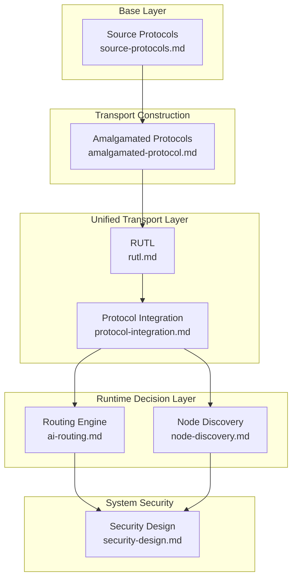

# Architecture Overview

This directory contains the complete architectural specifications for **Dawnset**.  
Each document defines a major subsystem and explains how Dawnset achieves
resilient, modular, and capability‑driven communication across diverse connectivity
environments.

The architecture is organized around several tightly integrated layers:

1. **Rust Unified Transport Layer (RUTL)** — unified lifecycle, capability model, and error semantics  
2. **Amalgamated Protocols** — performance‑, stealth‑, and survival‑oriented transports  
3. **Protocol Integration Layer** — composition pipeline from source protocols to RUTL  
4. **AI‑Driven Routing Engine** — heuristic + lightweight RL path selection  
5. **Decentralized Node Discovery** — multi‑source metadata distribution  
6. **System‑Wide Security Model** — confidentiality, integrity, availability, and linkability boundaries  
7. **Deployment Models** — architectural behavior across different operational environments  

All documents in this directory describe **architecture**, not implementation details.

---

## 1. Architectural Map

---

## 2. Files in This Directory

### **Core Transport Architecture**

#### **rutl.md**  
Full specification of the **Rust Unified Transport Layer (RUTL)**.  
Defines lifecycle, capability surfaces, handshake boundaries, error semantics, and
extensibility points.

#### **amalgamated-protocol.md**  
Architecture of the **Amalgamated Protocols (ruxvv, ruxsv, ruxpv)**.  
Explains how multiple source protocols are combined into cohesive transport families.

#### **source-protocols.md**  
Reference architecture for the **source protocols** (REALITY, uTLS, XTLS‑Vision,
XHTTP, VLESS).  
Describes their roles as internal building blocks.

#### **protocol-integration.md**  
Defines the integration pipeline from Source Protocols → Amalgamated Protocols → RUTL.  
Covers capability exposure, lifecycle alignment, and routing‑level consumption.

---

### **Routing & Discovery**

#### **ai-routing.md**  
Architecture of the AI‑driven routing engine.  
Describes heuristic scoring, lightweight RL adjustments, risk coefficients, and
multi‑hop path selection.

#### **node-discovery.md**  
Design of the decentralized discovery subsystem.  
Covers DHT, DNS TXT fallback, policy channels, metadata validation, and scoring.

---

### **Data Flow & Deployment**

#### **data-flow.md**  
End‑to‑end data‑flow architecture.  
Defines handshake sequencing, capability negotiation, multi‑hop forwarding, and
session rotation.

#### **deployment-models.md**  
Deployment‑level architectural considerations.  
Describes single‑node, multi‑node, edge‑optimized, and distributed deployments.

---

### **Security**

#### **security-design.md**  
Official system‑wide security model.  
Defines adversarial classes, metadata boundaries, mitigations, and implementation‑dependent assumptions.

#### **security-review.md**  
Independent architectural security assessment.  
Identifies structural risks (RL poisoning, handshake side‑channels, correlation risks)
and proposes hardening strategies.

---

### **Future Evolution**

#### **future-extensions.md**  
Framework for adding new transports, capabilities, routing strategies, and discovery
extensions without breaking existing architecture.

---

## 3. Purpose

The architecture directory provides:

### **Unified Reference**  
A consistent, system‑level specification for developers, auditors, and contributors.

### **Structural Transparency**  
Clear definitions of subsystem boundaries, capability surfaces, and integration points.

### **Long‑Term Stability**  
A future‑proof foundation that allows transports, routing models, and discovery
mechanisms to evolve independently.

Each document is self‑contained but designed to operate within a cohesive
architecture spanning transport, discovery, routing, and security.

---

## 4. Recommended Reading Order

For new contributors or reviewers:

1. **amalgamated-protocol.md**  
2. **source-protocols.md**  
3. **protocol-integration.md**  
4. **rutl.md**  
5. **ai-routing.md**  
6. **node-discovery.md**  
7. **data-flow.md**  
8. **deployment-models.md**  
9. **security-design.md**  
10. **security-review.md**  
11. **future-extensions.md**

This order moves from low‑level transport composition → integration → routing →
security → long‑term evolution.

---

## 5. Summary

This directory defines the complete architectural foundation of Dawnset.  
All subsystems integrate through:

- RUTL  
- Amalgamated Protocols  
- Node Discovery  
- Heuristic + RL Routing  
- Capability‑driven selection  

Together, they form a cohesive, extensible, and resilient architecture suitable for
challenging connectivity environments.
