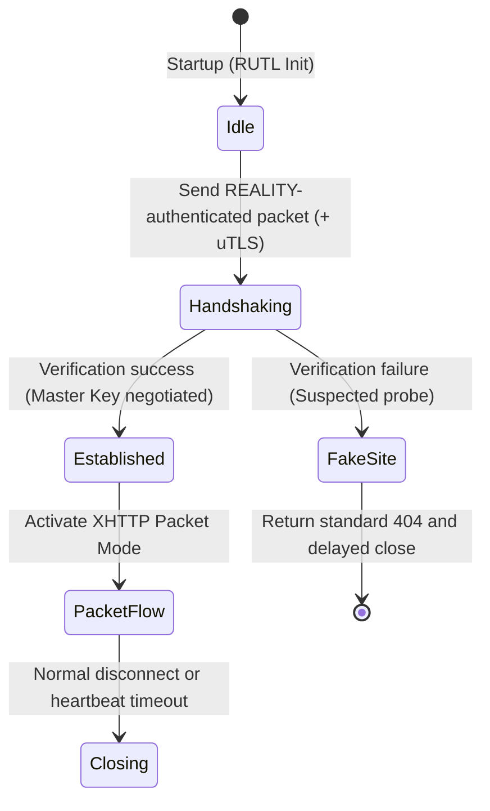

# ruxpv (Survival Edition)

## 1. Overview
ruxpv is the Survival edition of the Rux Protocol Suite.  
By integrating REALITY, uTLS, XHTTP (Packet), and VLESS, it establishes a transport system designed for extreme censorship environments.  
The design philosophy is to eliminate long‑connection signatures by fragmenting traffic into discrete HTTP requests, ensuring survivability even under aggressive statistical and active probing analysis.

---

## 2. Amalgamation Details
- **REALITY:** Provides TLS handshake mimicry and camouflage against DPI.  
- **uTLS:** Replicates mainstream browser fingerprints (e.g., Chrome) to evade static fingerprinting, with RUTL enforcing automatic hot‑updates to mitigate Parrot ID lag.  
- **XHTTP (Packet):** Encapsulates traffic into discrete HTTP requests, disguising sessions as ordinary web browsing with fragmented flows.  
- **VLESS:** Serves as a lightweight base transport, delegating encryption entirely to the TLS/REALITY layer, ensuring zero additional encryption overhead.  

---

## 3. State Machine
ruxpv defines an explicit state machine to govern packetized connection lifecycle and probe resistance.

**Key Design Features:**
- **Probe Redirection:** Verification failures redirect to FakeSite, mimicking legitimate 404 responses.  
- **Timing Obfuscation:** FakeSite responses include randomized delays to counter time‑based identification.  
- **Packet Camouflage:** XHTTP packet mode ensures traffic resembles ordinary discrete HTTP requests.  
- **Idle Patterns:** Packet flows may include randomized pauses to simulate natural browsing behavior, reducing statistical detectability.  

---

## 4. Observability
ruxpv defines observability dimensions to support routing intelligence and probe resistance:

- **Client Perspective:** Tracks handshake latency, TLS negotiation, and packet flow activation.  
- **Server Perspective:** Monitors REALITY authentication failures and uTLS fingerprint match rates.  
- **Routing Engine Perspective:** Evaluates packet flow stability, throughput under censorship pressure, and reconnection frequency.  
- **Adversary Perspective:** Encounters only discrete HTTP requests on standard ports; probing attempts receive valid 404 responses.  
- **Leakage Risk Check:** Observability model must include MTU sensitivity analysis to detect anomalies in packet fragmentation.  

---

## 5. Security Notes
- **Metadata Minimization:** VLESS headers contain no encryption instructions, preventing protocol‑specific parsing signatures.  
- **Fingerprint Fidelity:** RUTL enforces automatic hot‑updates for uTLS libraries to mitigate Parrot ID lag.  
- **Timing Obfuscation:** FakeSite responses include randomized delays to resist time‑based identification.  
- **Length Padding:** Randomized padding applied to handshake packets ensures conformity with legitimate TLS distributions.  
- **Packet Camouflage:** XHTTP packet mode conceals sessions within ordinary discrete HTTP requests.  
- **Dynamic HTTP Headers:** XHTTP request headers (User‑Agent, Referer, Cookie, etc.) must be dynamically generated to match the target FakeSite profile, preventing static header fingerprinting.  
- **Probabilistic Request Scheduling:** Randomization of request intervals to match human web‑surfing patterns, reducing statistical detectability.  
- **MTU Sensitivity:** Survival mode requires randomized fragmentation strategies to avoid packet size regularities.  

---

## 6. Integration with RUTL
In the Rust implementation, ruxpv maps to the Rust Unified Transport Layer (RUTL) abstraction as follows:

- **Handshake:** REALITY + uTLS  
- **Encryption:** Delegated to TLS/REALITY  
- **Obfuscation:** XHTTP Packet filter for camouflage  
- **Error Handling:** Implements `RUTL::Error::RedirectToFake` for probe redirection  
- **Session Context:** RUTL ensures session context can be reconstructed across multiple discrete HTTP requests without producing identifiable header correlations.  

---

## 7. Intended Use Cases
- **Extreme Censorship Regions:** Suitable for environments with aggressive DPI, statistical analysis, and active probing.  
- **Survival‑First Scenarios:** Ideal for users prioritizing concealment and survivability over performance.  
- **Discrete Traffic Simulation:** Effective in regions where fragmented HTTP requests are common and trusted.  

---

## 8. Future Expansion
- **Multi‑path Packet Distribution:** Survival mode may support distributing packets of the same session across multiple upstream nodes (next hops), further reducing detectability and improving resilience.
