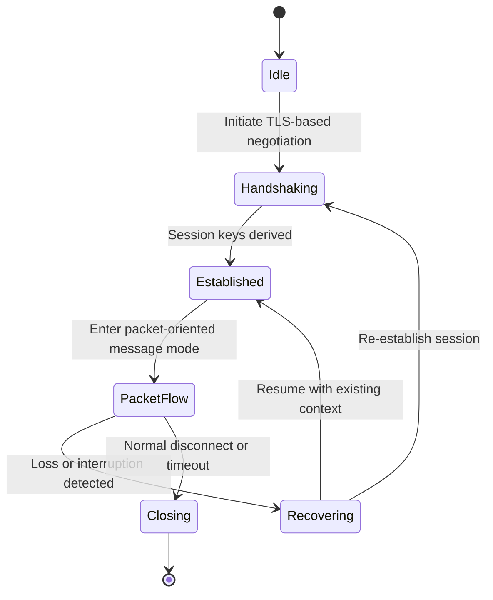

# ruxpv — Survival Edition (Packet‑Oriented Engineered Transport)

## 1. Overview

**ruxpv** is the packet‑oriented engineered transport within the Rux Protocol Suite.  
It implements Dawnset’s unified transport semantics using a **packet‑bounded message model** designed for resilience under unstable or intermittent connectivity.

ruxpv harmonizes multiple Source Protocols into a consistent, packet‑centric transport shape while remaining normalized by RUTL’s uniform transport abstraction.

---

## 2. Protocol Harmonization

ruxpv is constructed from the following Source Protocols:

- **REALITY**  
  Provides a TLS‑based handshake foundation and key establishment.

- **uTLS**  
  Ensures handshake behavior aligns with mainstream TLS client implementations.

- **XHTTP (Packet Mode)**  
  Serves as a material framing component; its external characteristics are normalized by RUTL’s uniform transport shape.

- **VLESS**  
  Provides lightweight framing while delegating encryption to the underlying TLS layer.

### Harmonization goals

- unify handshake semantics across all source components  
- provide a consistent packet‑oriented transport model  
- maintain predictable message boundaries  
- ensure compatibility with RUTL’s abstract transport shape  

---

## 3. State Machine

ruxpv defines an explicit state machine describing its packet‑oriented lifecycle.

### State semantics

- **Idle**  
  Transport instance created; awaiting initiation.

- **Handshaking**  
  REALITY + uTLS handshake executed under RUTL’s unified handshake model.

- **Established**  
  Session context created; encryption and key schedule active.

- **PacketFlow**  
  XHTTP (Packet Mode) used to exchange discrete, bounded messages.

- **Recovering**  
  Fast recovery path for unstable or intermittent connectivity.

- **Closing**  
  Graceful teardown and resource cleanup.

---

## 4. Observability Model

ruxpv exposes a structured observability model to support routing, diagnostics, and performance evaluation.

### Client perspective

- handshake latency  
- session establishment time  
- packet‑flow activation metrics  

### Server perspective

- handshake success/failure rates  
- session context initialization  
- message‑level throughput  

### Routing engine perspective

- packet‑flow stability  
- message round‑trip times  
- reconnection frequency  
- suitability for packet‑oriented workloads  

### Notes

The observability model focuses on **transport behavior**, not application semantics.

---

## 5. Security Notes

ruxpv inherits all security properties defined by RUTL and the underlying TLS‑based handshake.

Key considerations:

- **Metadata Management**  
  Minimal transport‑level metadata; message boundaries defined by XHTTP Packet Mode.

- **Handshake Consistency**  
  REALITY + uTLS handshake behavior conforms to mainstream TLS client patterns.

- **Boundary Regularity**  
  Optional framing‑level padding strategies may be applied to maintain boundary consistency under unstable conditions.

- **Session Keys**  
  Derived through REALITY’s TLS handshake; ephemeral keys ensure forward secrecy.

- **Message Integrity**  
  All messages are protected by TLS‑level encryption and integrity checks.

---

## 6. Integration with RUTL

ruxpv maps cleanly onto the Rust Unified Transport Layer:

- **Handshake**  
  REALITY + uTLS executed through RUTL’s unified handshake trait.

- **Encryption**  
  Fully delegated to the TLS layer; no additional encryption layers added.

- **Session Management**  
  RUTL manages session context, lifecycle, and teardown semantics.

- **Error Semantics**  
  ruxpv uses RUTL’s transport‑agnostic error model for consistent behavior across transports.

- **Transport Shape**  
  Implements RUTL’s packet‑oriented abstract transport shape.

---

## 7. Intended Use Cases

ruxpv is suitable for:

- **Packet‑centric communication patterns**  
  Environments where discrete request/response flows are operationally common.

- **Message‑based application workloads**  
  Systems that benefit from explicit message boundaries rather than continuous streams.

- **Multi‑transport deployments**  
  Scenarios where packet‑oriented transports complement stream‑oriented ones.

- **Extreme packet loss and intermittent connectivity**  
  Environments requiring resilience and rapid recovery.

---

## 8. Future Expansion

Potential areas for future development:

- **Multi‑path packet distribution**  
  Coordinating packet flows across multiple upstream paths for improved stability.

- **Adaptive message scheduling**  
  Using heuristic or lightweight model‑driven strategies to optimize packet dispatch timing.

- **Extended framing modes**  
  Additional message‑based framing strategies aligned with RUTL’s abstract transport semantics.
