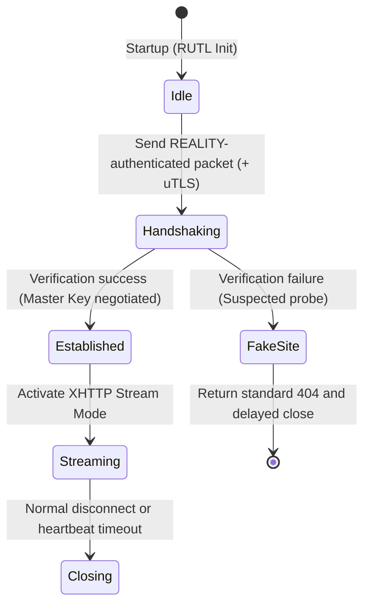

# ruxsv (Stealth Edition)

## 1. Overview
ruxsv is the Stealth edition of the Rux Protocol Suite.  
By integrating REALITY, uTLS, XHTTP (Stream), and VLESS, it establishes a transport system optimized for deep concealment under strict censorship regimes.  
The design philosophy is to maximize camouflage fidelity, resist active probing, and eliminate long‑connection signatures by blending into normal HTTPS traffic patterns.

---

## 2. Amalgamation Details
- **REALITY:** Provides TLS handshake mimicry and camouflage against DPI.  
- **uTLS:** Replicates mainstream browser fingerprints (e.g., Chrome) to evade static fingerprinting, with RUTL enforcing automatic hot‑updates to mitigate Parrot ID lag.  
- **XHTTP (Stream):** Encapsulates traffic within continuous HTTP streams, disguising long‑lived sessions as ordinary web activity.  
- **VLESS:** Serves as a lightweight base transport, delegating encryption entirely to the TLS/REALITY layer, ensuring zero additional encryption overhead.  

---

## 3. State Machine
ruxsv defines an explicit state machine to govern connection lifecycle and probe resistance.

**Key Design Features:**
- **Probe Redirection:** Verification failures redirect to FakeSite, mimicking legitimate 404 responses.  
- **Timing Obfuscation:** FakeSite responses include randomized delays to counter time‑based identification.  
- **Stream Camouflage:** XHTTP stream activation ensures traffic resembles ordinary web browsing sessions.  
- **Idle Patterns:** Long‑lived streams may optionally be split or paused to simulate natural browsing behavior, reducing statistical detectability.  

---

## 4. Observability
ruxsv defines observability dimensions to support routing intelligence and probe resistance:

- **Client Perspective:** Tracks handshake latency, TLS negotiation, and XHTTP stream activation.  
- **Server Perspective:** Monitors REALITY authentication failures and uTLS fingerprint match rates.  
- **Routing Engine Perspective:** Evaluates stream stability, throughput under censorship pressure, and reconnection frequency.  
- **Adversary Perspective:** Encounters only continuous HTTP traffic on standard ports; probing attempts receive valid 404 responses.  
- **Leakage Risk Check:** Observability model must include MTU sensitivity analysis to detect potential anomalies in stream packetization.  

---

## 5. Security Notes
- **Metadata Minimization:** VLESS headers contain no encryption instructions, preventing protocol‑specific parsing signatures.  
- **Fingerprint Fidelity:** RUTL enforces automatic hot‑updates for uTLS libraries to mitigate Parrot ID lag.  
- **Timing Obfuscation:** FakeSite responses include randomized delays to resist time‑based identification.  
- **Length Padding:** Randomized padding applied to handshake packets ensures conformity with legitimate TLS distributions.  
- **Stream Camouflage:** XHTTP stream mode conceals long‑lived sessions within ordinary web traffic patterns.  
- **Dynamic HTTP Headers:** XHTTP request headers (User‑Agent, Referer, Cookie, etc.) must be dynamically generated to match the target FakeSite profile, preventing static header fingerprinting.  

---

## 6. Integration with RUTL
In the Rust implementation, ruxsv maps to the Rust Unified Transport Layer (RUTL) abstraction as follows:

- **Handshake:** REALITY + uTLS  
- **Encryption:** Delegated to TLS/REALITY  
- **Obfuscation:** XHTTP Stream filter for camouflage  
- **Error Handling:** Implements `RUTL::Error::RedirectToFake` for probe redirection  

---

## 7. Intended Use Cases
- **High‑Risk Censorship Regions:** Suitable for environments with strict DPI and active probing.  
- **Stealth‑First Scenarios:** Ideal for users requiring maximum concealment over performance.  
- **Web‑Dominated Traffic Flows:** Effective in regions where ordinary HTTPS traffic is prevalent and trusted.
