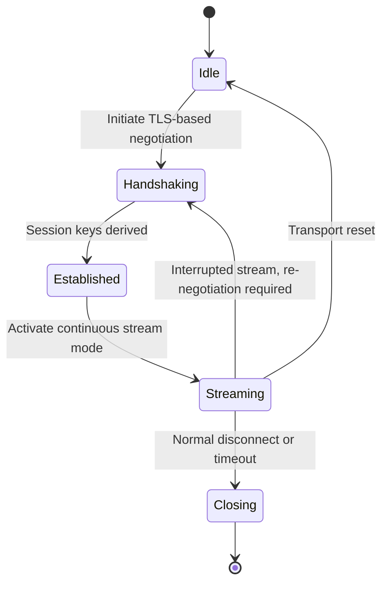

# ruxsv — Stealth Edition (Metadata‑Stable Stream Transport)

## 1. Overview

ruxsv is the Stealth Edition of the Rux Protocol Suite.  
In the context of sovereign‑grade digital infrastructure, “Stealth” refers to **metadata stability**, **predictable stream behavior**, and **consistent long‑connection characteristics** across heterogeneous network environments.

ruxsv integrates multiple Material Components into a unified, stream‑oriented transport shape defined by the Rust Unified Transport Layer (RUTL).  
Its design emphasizes:

- stable flow characteristics  
- reduced metadata variability at the framing layer, consistent with RUTL’s uniform shape  
- predictable long‑lived stream semantics  
- interoperability across diverse deployment environments  

---

## 2. Composition Model

ruxsv harmonizes the following Material Components:

- **REALITY**  
  Provides a TLS‑based handshake foundation and key establishment.

- **uTLS**  
  Ensures handshake behavior aligns with mainstream TLS client implementations, supporting broad interoperability.

- **XHTTP (Stream Mode)**  
  Supplies a continuous, structured stream framing model suitable for long‑duration connections.

- **VLESS**  
  Acts as a lightweight framing layer, delegating encryption to the underlying TLS layer.

### Composition goals

- unify handshake behavior across Material Components  
- provide a consistent stream‑oriented transport model  
- maintain stable flow characteristics  
- ensure compatibility with RUTL’s abstract transport shape  

---

## 3. State Machine

ruxsv defines a deterministic state machine for stream‑oriented operation.

### State semantics

- **Idle**  
  Transport instance created; awaiting initiation.

- **Handshaking**  
  REALITY + uTLS handshake executed under RUTL’s unified handshake model.

- **Established**  
  Session context created; encryption and key schedule active.

- **Streaming**  
  XHTTP Stream Mode provides continuous, structured stream semantics.

- **Recovery Paths**  
  Stream interruptions may trigger re‑negotiation or transport reset.

- **Closing**  
  Graceful teardown and resource cleanup.

---

## 4. Observability Model

ruxsv exposes observability dimensions to support routing, diagnostics, and operational analysis.

### Client perspective

- handshake latency  
- session establishment time  
- stream activation metrics  

### Server perspective

- handshake success/failure rates  
- session context initialization  
- stream throughput and stability  

### Routing engine perspective

- long‑connection stability  
- flow‑level round‑trip characteristics  
- reconnection frequency  
- suitability for stream‑oriented workloads  

### Notes

The observability model focuses on **transport behavior**, not application semantics.

---

## 5. Security and Stability Notes

ruxsv inherits all security properties defined by RUTL and the underlying TLS‑based handshake.

Key considerations:

- **Metadata Stability**  
  Stream framing minimizes unnecessary metadata variability at the framing layer, consistent with RUTL’s uniform shape.

- **Handshake Consistency**  
  REALITY + uTLS handshake behavior aligns with mainstream TLS client patterns.

- **Flow Regularity**  
  Stream Mode maintains consistent flow characteristics suitable for long‑duration connections.

- **Session Keys**  
  Derived through REALITY’s TLS handshake; ephemeral keys ensure forward secrecy.

- **Message Integrity**  
  All stream data is protected by TLS‑level encryption and integrity checks.

---

## 6. Integration with RUTL

ruxsv maps cleanly onto the Rust Unified Transport Layer:

- **Handshake**  
  REALITY + uTLS executed through RUTL’s unified handshake trait.

- **Encryption**  
  Fully delegated to the TLS layer; no additional encryption layers added.

- **Stream Semantics**  
  Implements RUTL’s stream‑oriented abstract transport shape.

- **Session Management**  
  RUTL manages session context, lifecycle, and teardown semantics.

- **Error Semantics**  
  ruxsv uses RUTL’s transport‑agnostic error model for consistent behavior across transports.

---

## 7. Intended Use Cases

ruxsv is suitable for:

- **Long‑lived stream workloads**  
  Environments requiring stable, continuous stream behavior.

- **Metadata‑sensitive deployments**  
  Systems that benefit from reduced metadata variability.

- **Heterogeneous network environments**  
  Deployments requiring predictable flow behavior across diverse network conditions.

- **Infrastructure‑level services**  
  Scenarios where consistent stream semantics support higher‑level orchestration or routing components.
