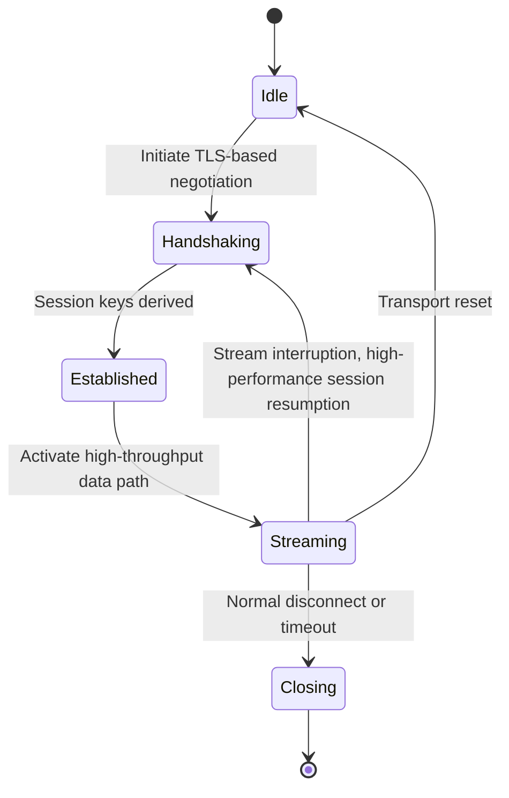

# ruxvv — Performance Edition (High‑Throughput Stream Transport)

## 1. Overview

ruxvv is the Performance Edition of the Rux Protocol Suite.  
It provides a **high‑throughput, low‑latency transport model** designed for environments that require efficient data movement, stable flow control, and predictable performance under sustained load.

ruxvv integrates multiple Material Components into a unified transport shape defined by the Rust Unified Transport Layer (RUTL).  
Its design emphasizes:

- throughput stability  
- efficient flow control  
- minimized processing overhead  
- predictable performance across heterogeneous network environments  

---

## 2. Composition Model

ruxvv harmonizes the following Material Components:

- **REALITY**  
  Provides a TLS‑based handshake foundation and session key establishment.

- **uTLS**  
  Ensures handshake behavior aligns with mainstream TLS client implementations, supporting broad interoperability.

- **XTLS‑Vision**  
  Supplies an optimized data path with efficient flow control and **optional padding mechanisms to ensure consistent MTU utilization and prevent traffic analysis fragmentation**.

- **VLESS**  
  Acts as a lightweight framing layer, delegating encryption to the underlying TLS layer.

### Composition goals

- unify handshake behavior across Material Components  
- provide a high‑performance transport model  
- maintain stable throughput under sustained load  
- ensure compatibility with RUTL’s abstract transport shape  

---

## 3. State Machine

ruxvv defines a deterministic state machine for high‑performance operation.

### State semantics

- **Idle**  
  Transport instance created; awaiting initiation.

- **Handshaking**  
  REALITY + uTLS handshake executed under RUTL’s unified handshake model.

- **Established**  
  Session context created; encryption and key schedule active.

- **Streaming**  
  XTLS‑Vision provides an optimized, high‑throughput data path.

- **Recovery Paths**  
  Stream interruptions trigger **high‑performance session resumption** or transport reset.

- **Closing**  
  Graceful teardown and resource cleanup.

---

## 4. Observability Model

ruxvv exposes observability dimensions to support routing, diagnostics, and performance evaluation.

### Client perspective

- handshake latency  
- session establishment time  
- throughput activation metrics  

### Server perspective

- handshake success/failure rates  
- session context initialization  
- sustained throughput characteristics  

### Routing engine perspective

- bandwidth utilization  
- flow‑level round‑trip characteristics  
- reconnection frequency  
- suitability for high‑throughput workloads  

### Notes

The observability model focuses on **transport behavior**, not application semantics.

---

## 5. Security and Stability Notes

ruxvv inherits all security properties defined by RUTL and the underlying TLS‑based handshake.

Key considerations:

- **Metadata Stability**  
  Transport framing minimizes unnecessary metadata variability at the framing layer, consistent with RUTL’s uniform shape.

- **Flow Control Efficiency**  
  XTLS‑Vision provides stable throughput under varying network conditions.

- **Handshake Consistency**  
  REALITY + uTLS handshake behavior aligns with mainstream TLS client patterns.

- **Session Keys**  
  Derived through REALITY’s TLS handshake; ephemeral keys ensure forward secrecy.

- **Message Integrity**  
  All data is protected by TLS‑level encryption and integrity checks.

---

## 6. Integration with RUTL

ruxvv maps cleanly onto the Rust Unified Transport Layer:

- **Handshake**  
  REALITY + uTLS executed through RUTL’s unified handshake trait.

- **Encryption**  
  Fully delegated to the TLS layer; no additional encryption layers added.

- **Performance Path**  
  XTLS‑Vision provides an optimized data path consistent with RUTL’s stream‑oriented transport shape.

- **Session Management**  
  RUTL manages session context, lifecycle, and teardown semantics.

- **Error Semantics**  
  ruxvv uses RUTL’s transport‑agnostic error model for consistent behavior across transports.

---

## 7. Intended Use Cases

ruxvv is suitable for:

- **High‑throughput workloads**  
  Environments requiring sustained bandwidth and efficient data movement.

- **Performance‑sensitive deployments**  
  Systems that benefit from optimized flow control and reduced processing overhead.

- **Heterogeneous network environments**  
  Deployments requiring predictable performance across diverse network conditions.

- **Infrastructure‑level services**  
  Scenarios where stable throughput supports higher‑level orchestration or routing components.
