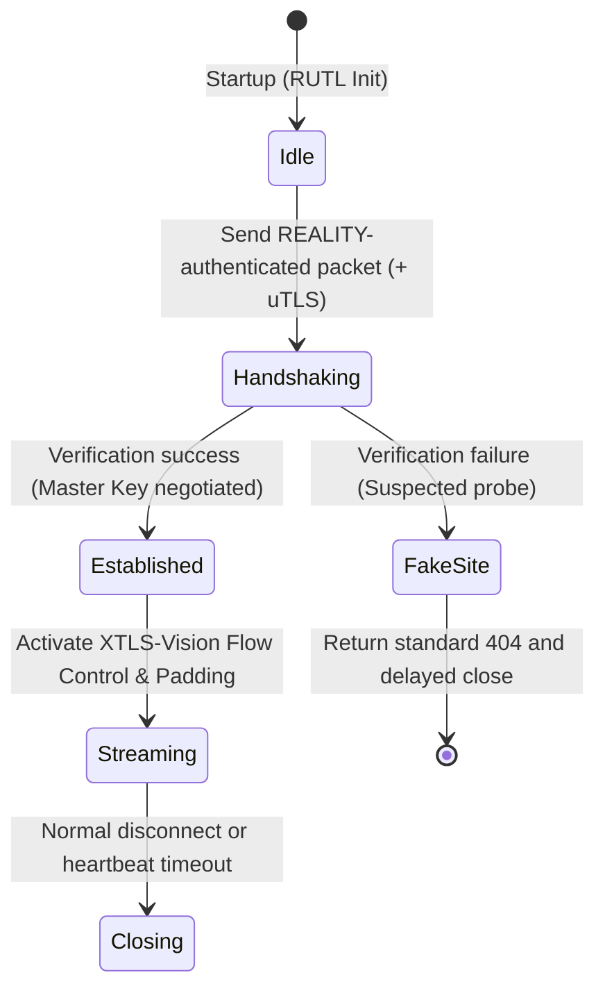

# ruxvv (Performance Edition)

## 1. Overview
ruxvv is the Performance edition of the Rux Protocol Suite.  
By deeply integrating REALITY, uTLS, XTLS‑Vision, and VLESS, it establishes a unified transport system optimized for high‑performance and high‑throughput scenarios.  
The core design philosophy is to minimize metadata overhead while leveraging XTLS‑Vision to eliminate TLS‑in‑TLS signatures and REALITY to provide indistinguishable TLS mimicry.

---

## 2. Amalgamation Details
- **REALITY:** Implements full‑fidelity TLS handshake mimicry, eliminates server‑side fingerprints, and provides robust resistance against active probing.  
- **uTLS:** Replicates mainstream browser fingerprints (e.g., Chrome) for the TLS Client Hello to evade static fingerprinting. RUTL enforces automatic hot‑updates to mitigate Parrot ID lag.  
- **XTLS‑Vision:** Introduces flow control and padding mechanisms to eliminate length distribution signatures typical of encrypted traffic within TLS tunnels.  
- **VLESS:** Acts as a lightweight, stateless base transport that delegates all data encryption to the outer REALITY/TLS layer, achieving zero additional encryption overhead.  

---

## 3. State Machine
ruxvv utilizes an explicit state machine to govern the connection lifecycle, ensuring that behavior at every stage aligns with mimicry expectations.

**Key Design Features:**
- **Probe Redirection:** Failures during verification force a transition to the FakeSite state, mimicking the 404 behavior of a legitimate web server.  
- **Timing Obfuscation:** Responses in the FakeSite state must include randomized processing delays to counter protocol identification via time‑based analysis.  
- **Flow Control Synchronization:** XTLS‑Vision algorithms are only activated after reaching the Established state, ensuring that handshake packet lengths strictly conform to standard TLS signatures.  

---

## 4. Observability
To support AI‑driven routing and selection, ruxvv defines the following observability dimensions:

- **Client Perspective:** Monitors handshake latency (RTT), TLS version negotiation, and XTLS‑Vision activation status.  
- **Server Perspective:** Tracks REALITY authentication failure frequency and uTLS fingerprint library match rates.  
- **Routing Engine Perspective:** Evaluates throughput saturation, packet loss‑triggered reconnection frequency, and bandwidth utilization.  
- **Adversary Perspective:** Observes only randomized encrypted traffic on standard HTTPS ports; active probing encounters valid 404 responses matching the target domain.  
- **Leakage Risk Check:** Observability model must include MTU sensitivity analysis to detect potential packet size anomalies.  

---

## 5. Security Notes
- **Metadata Minimization:** The VLESS header contains no encryption instructions, preventing protocol‑specific parsing signatures.  
- **Fingerprint Fidelity:** RUTL enforces automatic hot‑updates for uTLS libraries to mitigate Parrot ID lag.  
- **Timing Obfuscation:** FakeSite responses include randomized delays to resist time‑based identification.  
- **Length Padding:** Randomized padding is applied to handshake packets to ensure initial packet sizes fall within the statistical distribution of legitimate TLS handshakes.  

---

## 6. Integration with RUTL
In the Rust implementation, ruxvv maps to the Rust Unified Transport Layer (RUTL) abstraction as follows:

- **Handshake:** Binds to the REALITY + uTLS state machines.  
- **Encryption:** Directly utilizes the RUTL shared TLS buffer; no secondary encryption is performed.  
- **Obfuscation:** Mounts the XTLS‑Vision filter to handle traffic padding.  
- **Error Handling:** Implements the `RUTL::Error::RedirectToFake` interface to execute camouflage responses.  

---

## 7. Intended Use Cases
- **Medium‑Risk Censorship Regions:** Ideal for long‑term stability and bandwidth‑intensive tasks such as 4K video streaming or large file downloads.  
- **Performance‑First Scenarios:** Deployment on hardware‑constrained devices (e.g., low‑power routers) that still require strong mimicry.  
- **Persistent Sessions:** Leveraging Vision to maintain characteristic stability for long‑lived connections.
